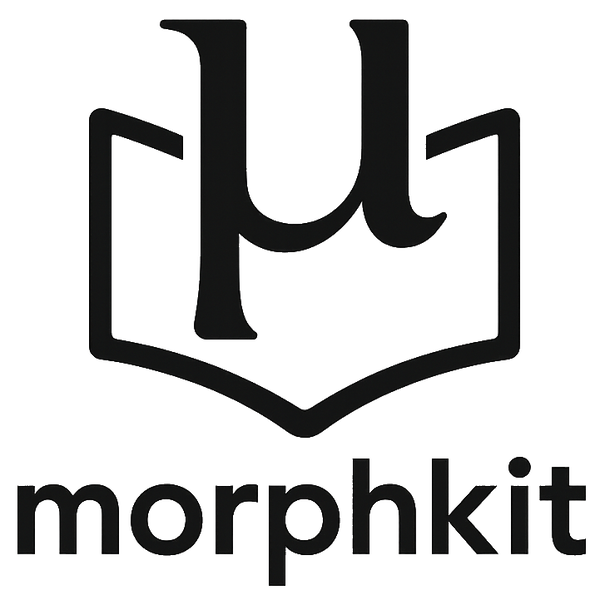

[](https://www.repostatus.org/#active)  [](https://tonyjurg.github.io/morphkit/) [](https://creativecommons.org/licenses/by/4.0/) [](https://doi.org/10.5281/zenodo.15920832) [](https://archive.softwareheritage.org/browse/origin/?origin_url=https://github.com/tonyjurg/morphkit)



Morphkit is a Python toolkit for Greek morphological analysis and tag similarity comparison. It uses the [`betacode`](https://github.com/perseids-tools/beta-code-py) library, the API of Morpheus (e.g., running in a [Docker virtualisation environment](https://hub.docker.com/r/perseidsproject/morpheus-api)) and a porting of the [Sandborg-Petersen morphological decoder](https://github.com/tonyjurg/Sandborg-Petersen-decoder).

## Documentation

For documentation see [tonyjurg.github.io/morphkit](https://tonyjurg.github.io/morphkit/).

## Package

For the actual code see [/morphkit](https://github.com/tonyjurg/morphkit/tree/main/morphkit).

## Loading

Since it is not a 'real' package (i.e., installable with `pip`), you need to load it locally. For example in a Jupyter Notebook:

```Python
import sys
sys.path.insert(0, "..")    # the relative path for the morphkit directory to your notebook dir
import morphkit
```

## Tools used

The standard set of tools ([Python documentation](https://www.python.org/doc/), tech sites like [stackoverflow](https://stackoverflow.com/), and Python syntax checkers like [Pythonium](https://pythonium.net/linter)) were used to create this package. Furthermore, for the creation of a subset of features, also the [Anaconda Assistant](https://www.anaconda.com/capability/anaconda-assistant) (using [OpenAI](https://openai.com/) as backend) and [GitHub Copilot](https://github.com/features/copilot) in Visual Studio were used to debug and/or optimize parts of the code.

## License

The morphkit package is released under the [Creative Commons Attribution 4.0 International (CC BY 4.0)](https://github.com/tonyjurg/morphkit/blob/main/LICENSE.md).

